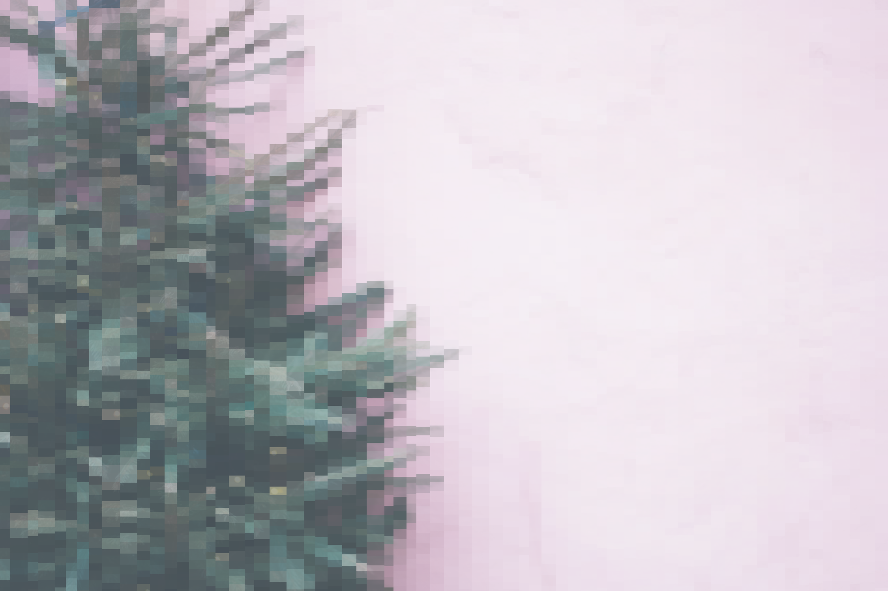
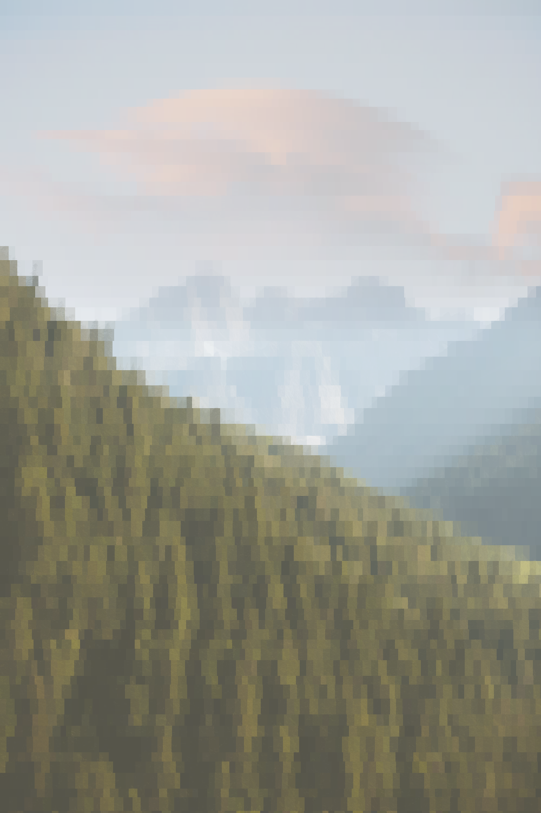
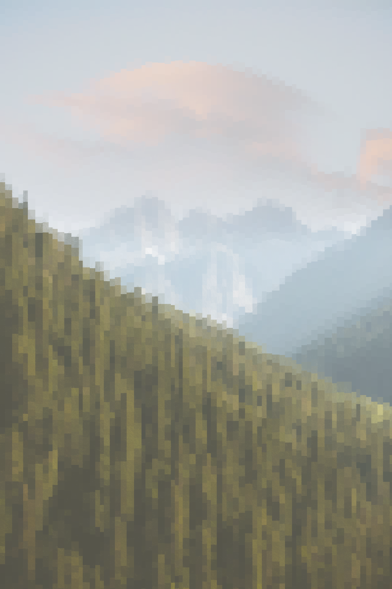
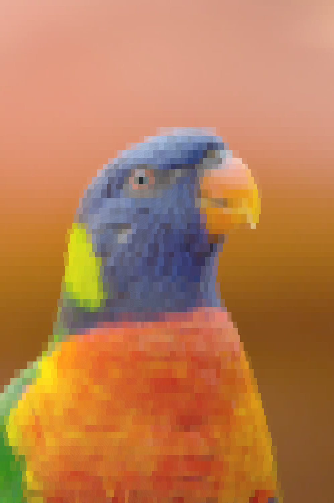

# Go-Generative-Art
Uses golang to manipulates a photo to appear more pixelated. I started this project to familiarize myself more with the language and to create a fun side project. 

## Usage
To use this project, you will require Golang vesion >1.15.2 as well as github.com/fogleman/gg installed as a package. 

The image you want should be in the same folder as the main.go file and the code is documented on how to change the image used.

## How it works
The program follows the following basic steps:

1. Read an image
2. Go through a row of pixels
3. Draw a rectangle of a semi-random width and height
4. Get the average color of pixels in that rectangle
5. Fill the rectangle with the average color
6. Move over the width of the rectangle
7. Repeat the process for the whole row and then move down the height of the rectangles and repeat again

## Example

### Before

### After
Horizontally | Vertically
:-:|:-:
 | 
 | 
 | 

## Roadmap
I am currently looking to improve upon the algorithm so that the image may look less pixelated and more abstract. 

## License
[MIT](https://choosealicense.com/licenses/mit/)